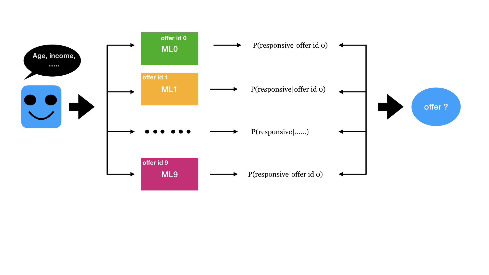

# Starbucks Promotion Strategy
This project is a part of Udacity Data Science Nanodegree

### 1. Project Overview

Starbucks provided simulated data that mimics customer behavior on the Starbucks rewards mobile app. Once a while, Starbucks will sends out an offer to users. An offer can an advertisement for a drink or a discount or BOGO (buy one get one free). If the customer finish the requirement before the offer expired, they will receive the reward. The goal of the promotion is to motivate customers to make more purchases and increase the profits for the company. Therefore, our objective will be to identify customers whom are inclined to spent more when offered with the promotion. We will define this type of customer as 'responsive' to a specific offer.

Our plan is to design a set of ML models which will predict whether a customer will spent more on a specific offer given the customer's information. The final marketing strategy for the customer will be determined by comparing all the probability of being responsive for different promotion offers.

### 2. Project Components

The problem that I chose to solve was to build a model that predicts whether a customer will viewed an offer and spent more than normal.
Here are the 3 notebooks and 1 python file that I am working on through the analysis :  

1- data cleaning.ipynb

2- Feature engineer and EDA.ipynb

3- modelling.ipynb

4- model_helper.py

### 3. Installation

 - Python versions 3.*.
 - Data Processing & Machine Learning Libraries: NumPy, SciPy, Pandas, Sciki-Learn, XGBoost, SMOTE
 - Data Visualization: Matplotlib, Seaborn

### 4. File Descriptions

The data is contained in three files:

* portfolio.json - containing offer ids and meta data about each offer (duration, type, etc.)
* profile.json - demographic data for each customer
* transcript.json - records for transactions, offers received, offers viewed, and offers completed

Here is the schema and explanation of each variable in the files:

**portfolio.json**
* id (string) - offer id
* offer_type (string) - type of offer ie BOGO, discount, informational
* difficulty (int) - minimum required spend to complete an offer
* reward (int) - reward given for completing an offer
* duration (int) - time for offer to be open, in days
* channels (list of strings)

**profile.json**
* age (int) - age of the customer 
* became_member_on (int) - date when customer created an app account
* gender (str) - gender of the customer (note some entries contain 'O' for other rather than M or F)
* id (str) - customer id
* income (float) - customer's income

**transcript.json**
* event (str) - record description (ie transaction, offer received, offer viewed, etc.)
* person (str) - customer id
* time (int) - time in hours since start of test. The data begins at time t=0
* value - (dict of strings) - either an offer id or transaction amount depending on the record

### 5. Result
We have built ten XGBoost classifier combined with SMOTE method to predict the customers who are responsive for each offer id. The 10 classifier have an average recall of 0.6 and an average precision of 0.2.
The main summary of the results:
* The offer id 1 (Discount 7/7/3) and the offer id 9 ( Discount 10/10/2) have the highest proportion of the responsive customers. If we don't know any information of a new customer, we can simply offer either of the two promotions. 
* Among all the offer types, female customer have higher probability to response to the promotions. 
people who become member in 2016 and 2017 have higher probability to response to the promotions.
older people(age > 50s) will be more responsive the the promotions.
* People with income between 50–70k are more inclined to purchase more when offered with the promotions.

The main analysis are published on medium [here](https://medium.com/@qianh1225/design-a-starbuck-promotion-strategy-d61400543651)

### 6. Acknowledgements<a name="licensing">
This project was completed as part of the [Udacity Data Science Nanodegree]. The dataset used in this project contains simulated data that mimics customer behavior on the Starbucks rewards mobile app. [Starbucks® Rewards program: Starbucks Coffee Company](https://www.starbucks.com/rewards/).

